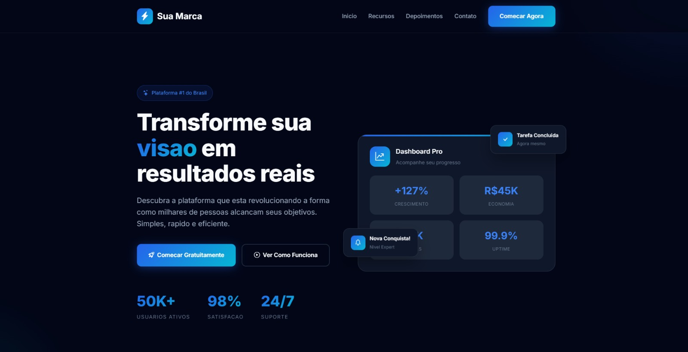

# Lead Page - Projeto de Captacao de Leads

Uma landing page moderna e profissional desenvolvida em HTML, CSS e JavaScript puro, com design em tons de azul e totalmente responsiva.

## Visualizacao



## Caracteristicas

### Design
- Esquema de cores em tons de azul (Primary: #2563eb, Accent: #06b6d4)
- Gradientes modernos e elegantes
- Cards com efeitos de hover e sombras suaves
- Tipografia limpa e legivel (Inter font)
- Layout responsivo para todos os dispositivos

### Secoes Incluidas
1. **Header** - Navegacao fixa com menu responsivo
2. **Hero** - Secao principal com CTA e estatisticas
3. **Features** - 6 recursos/beneficios em grid
4. **Depoimentos** - Carrossel de testemunhos de clientes
5. **Formulario** - Captura de leads com validacao
6. **CTA Final** - Chamada para acao com gradiente
7. **Footer** - Informacoes de contato e redes sociais

### Funcionalidades
- Loader de carregamento animado
- Menu hamburguer para mobile
- Smooth scroll para navegacao
- Botao "Voltar ao Topo"
- Mascara de telefone brasileiro
- Validacao de formulario
- Animacoes de entrada (fade-in)
- Carrossel de depoimentos automatico

## Tecnologias Utilizadas

- **HTML5** - Estrutura semantica
- **CSS3** - Estilos com variaveis CSS, Flexbox, Grid e animacoes
- **JavaScript** - Vanilla JS para interatividade
- **Google Fonts** - Fonte Inter

## Instalacao

1. Clone ou baixe o repositorio
2. Abra o arquivo `index.html` em seu navegador

```bash
# Clonar repositorio
git clone https://seu-repositorio.git

# Acessar pasta
cd lead-page

# Abrir no navegador (Linux/Mac)
open index.html

# Ou simplesmente arraste o arquivo para o navegador
```

## Estrutura do Projeto

```
/
├── index.html          # Arquivo principal (HTML + CSS + JS)
└── README.md           # Documentacao
```

## Personalizacao

### Cores
Edite as variaveis CSS no inicio do arquivo:

```css
:root {
    --primary: #2563eb;      /* Azul principal */
    --primary-dark: #1d4ed8; /* Azul escuro */
    --accent: #06b6d4;       /* Ciano de destaque */
    --dark: #0f172a;         /* Fundo escuro */
    --light: #f8fafc;        /* Fundo claro */
}
```

### Conteudo
- Altere os textos diretamente no HTML
- Substitua os icones SVG conforme necessario
- Atualize links de redes sociais no footer

### Formulario
O formulario esta configurado para exibir um alerta de sucesso. Para integrar com um backend:

```javascript
form.addEventListener('submit', async function(e) {
    e.preventDefault();
    
    const formData = new FormData(form);
    
    // Enviar para seu backend
    const response = await fetch('/sua-api', {
        method: 'POST',
        body: formData
    });
    
    // Tratar resposta
});
```

## Compatibilidade

- Chrome 80+
- Firefox 75+
- Safari 13+
- Edge 80+
- Opera 67+

## Licenca

Este projeto esta sob a licenca MIT. Sinta-se livre para usar, modificar e distribuir.

## Autor

Desenvolvido com base no design original, refatorado para uma lead page moderna em tons de azul.

---

**Nota:** Todos os conteudos de video e referencias ao site original foram removidos. Esta e uma versao limpa para uso como template de captura de leads.
